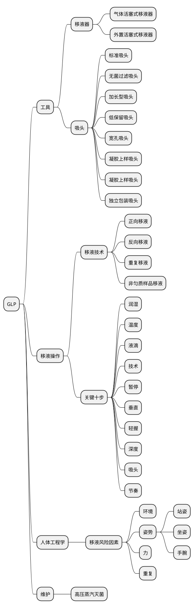

# GLP指南

[移液基础](https://www.thermofisher.cn/cn/zh/home/life-science/lab-plasticware-supplies/lab-plasticware-supplies-learning-center/lab-plasticware-supplies-resource-library/fundamentals-of-pipetting.html)

