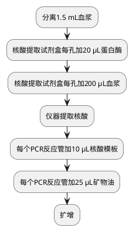

# 丙型肝炎病毒基因分型

<procedure title="Add something" id="procedure-id">
   <step>全血离心，分离1.5 mL血浆到微量离心管，做好标记。</step>
   <step>核酸提取试剂盒每孔加20 μL蛋白酶。</step>
   <step>核酸提取试剂盒每孔加200 μL血浆。</step>
   <step>仪器提取核酸。</step>
   <step>每个PCR反应管加10 μL核酸模板。</step>
   <step>每个PCR反应管加25 μL矿物油。</step>
</procedure>

基因分型方法有很多，目前应用最广泛的是Simmonds等提出的1～6型分型法。
其中基因1型最为常见，全球约占46.2%。我国以1b和2a型为主
由于基因型与抗病毒疗效的关系密切，开展HCV基因分型将有助于判断疗效和实施个体化医疗。
丙型肝炎抗体转阴的时程则较长，故丙型肝炎恢复期便会出现抗体阳性而HCV-RNA阴性的情况。

> 《流行病学·第二巻（第3版）》曹务春 |微信读书
