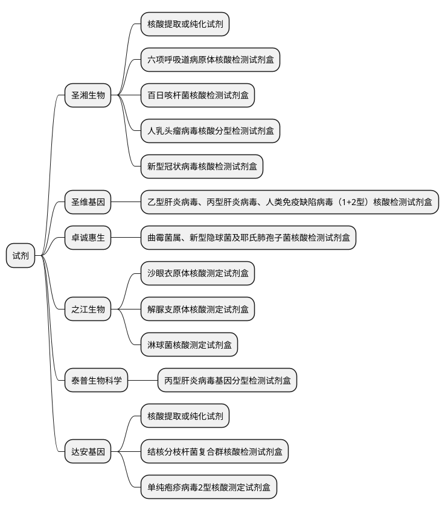
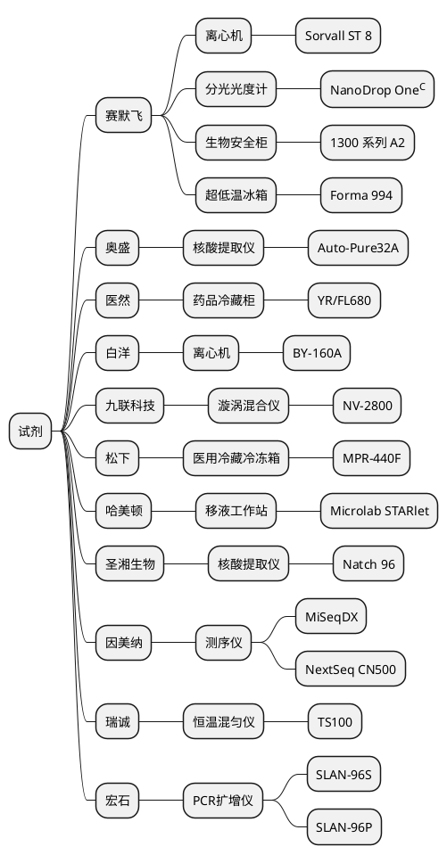

# 临床分子检验实验室
## 实验室设计参考标准
《临床分子生物学检验技术要求》黄宪章 徐建华 熊玉娟

## 耗材一览

| 厂商 | 型号 | 规格 |
|----|----|----|

## 试剂一览

```plantuml
@startmindmap
* 试剂
    * 圣湘生物
        * 核酸提取或纯化试剂
        * 六项呼吸道病原体核酸检测试剂盒
        * 百日咳杆菌核酸检测试剂盒
        * 人乳头瘤病毒核酸分型检测试剂盒
        * 新型冠状病毒核酸检测试剂盒
    * 圣维基因
        * 乙型肝炎病毒、丙型肝炎病毒、人类免疫缺陷病毒（1+2型）核酸检测试剂盒
    * 卓诚惠生
        * 曲霉菌属、新型隐球菌及耶氏肺孢子菌核酸检测试剂盒
    * 之江生物
        * 沙眼衣原体核酸测定试剂盒
        * 解脲支原体核酸测定试剂盒
        * 淋球菌核酸测定试剂盒
    * 泰普生物科学
        * 丙型肝炎病毒基因分型检测试剂盒
    * 达安基因
        * 核酸提取或纯化试剂
        * 结核分枝杆菌复合群核酸检测试剂盒
        * 单纯疱疹病毒2型核酸测定试剂盒
@endmindmap
```

## 仪器一览

```plantuml
@startmindmap
* 试剂
    * 赛默飞
        * 离心机
            * Sorvall ST 8
        * 分光光度计
            * NanoDrop One<sup>C</sup>
        * 生物安全柜
            * 1300 系列 A2
        * 超低温冰箱
            * Forma 994
    * 奥盛
        * 核酸提取仪
            * Auto-Pure32A
    * 医然
        * 药品冷藏柜
            * YR/FL680
    * 白洋
        * 离心机
            * BY-160A
    * 九联科技
        * 漩涡混合仪
            * NV-2800
    * 松下
        * 医用冷藏冷冻箱
            * MPR-440F
    * 哈美顿
        * 移液工作站
            * Microlab STARlet
    * 圣湘生物
        * 核酸提取仪
            * Natch 96
    * 因美纳
        * 测序仪
            * MiSeqDX
            * NextSeq CN500
    * 瑞诚
        * 恒温混匀仪
            * TS100
    * 宏石
        * PCR扩增仪
            * SLAN-96S
            * SLAN-96P
@endmindmap
```