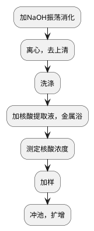

# 呼吸道病原体核酸八项检测
## 检测目的和原理

## 标本采集
### 样品保存
### 样品运输

## 处理流程
### 仪器设备
晶芯®RTisochip™-A 恒温扩增微流控芯片核酸分析仪

### 试剂耗材
* 4% NaOH：20 g NaOH + 500 mL ddH2O
* 1,000 μL移液器吸头
* 100 μL移液器吸头
* 核酸提取试剂盒
* 恒温扩增微流控芯片

### 软件
恒温扩增微流控芯片核酸分析仪控制软件
### 准备工作
* 金属浴预热至95°C
* 博奥晶典仪器开机
* 吸光度检测仪开机，打开光源预热（需预热约10 min），编好样本信息。

### 流程图

### 详细流程
<procedure>
<step>
样本消化。
<tabs>
<tab title="痰液">
<include from="library.md" element-id="NaOH溶液消化"></include>

> 若标本含食物残渣较多，则分装2个离心管低速（rpm）离心5 min后取上清液。
> {style="note"}

</tab>
<tab title="肺泡灌洗液">

<include from="library.md" element-id="NaOH溶液消化"></include>

> 肺泡灌洗液可富集2次。
> {style="note"}

</tab>
<tab title="咽拭子">
无需消化，12,000 rpm离心5 min后进行第3步洗涤。
</tab>
</tabs>
</step>
<step>取1 mL样本到离心管，12,000 rpm离心5 min。</step>

> 样本消化后若较清澈可取2管离心。
> {style="note"}

<step>弃上清，加1 mL洗液，吹吸混匀后再振荡混匀，12,000 rpm离心 5min。视沉淀物量可重复洗涤次。</step>
<step>加100 μL核酸提取液，若沉淀较多可多加核酸提取液。吹打混匀后转移至提取柱中，1,500 rpm振荡、95°C金属浴10 min。</step>
<step>12,000 r/min离心2 min，测定核酸浓度和纯度，以50 μg/μL为宜。根据浓度决定是否要浓缩或稀释。</step>

> 可根据提取过程中转管之前的沉淀量确定核酸上机前的稀释倍数。
> 绿豆大小：20-30倍稀释；米粒大小：10-15稀释；
> 半粒米大小：5-8倍稀释；小米或芝麻大小：2-3倍稀释；
> 针眼大小或肉眼无法识别大小：可不稀释。
> {style="note"}

<step>将35 μL（或36 μL样本）核酸模板和20 μL（或22 μL）扩增液混匀，瞬时离心。</step>
<step>取52 μL体积一次性冲满芯片，封口。冲池好的芯片可在4°C下暂时保存。</step>
<step>芯片离心30 s，确保外圈大环内无气泡，进样口向下放入恒温扩增微流控芯片核酸分析仪，指定样本信息，开始扩增。
若液体体积不足，未充满，需重新冲池离心。</step>

</procedure>

### 结果判读

<procedure>
<step>首先判断阳性外对照和阴性？对照。阳性对照在25 min左右起跳表明样本核酸浓度比较合适。
正常扩增情况下，铜绿假单胞菌扩增线（黄色）在最上方。
若放反，结果可根据任意2个对称孔位的编号相加等于26进行纠正，如14号位实际上为12号位。</step>
<step>耐甲氧西林葡萄球菌阳性时，扩增线起跳最早。</step>
<step>阴性质控线最好在5,000以下。</step>
</procedure>

## 结果报告和解释
<procedure>
<step>耐甲氧西林葡萄球菌需在金黄色葡萄球菌出现的前提下，才报告阳性，仅耐甲氧西林葡萄球菌阳性不报告。</step>
<step>扩增曲线起跳较晚时，可结合临床进行备注：xx有扩增，低于最低检测限，请结合临床。</step>
</procedure>

### 生物参考区间、医学决定水平、危急值

| 缩写  | 项目名称      | 参考范围 |
|-----|-----------|------|
| Spn | 肺炎链球菌     | 阴性   |
| Sau | 金黄色葡萄球菌   | 阴性   |
| Mrs | 耐甲氧西林葡萄球菌 | 阴性   |
| Kpn | 肺炎克雷伯菌    | 阴性   |
| Pae | 铜绿假单胞菌    | 阴性   |
| Aba | 鲍曼不动杆菌    | 阴性   |
| Sma | 嗜麦芽窄食单胞菌  | 阴性   |
| Hin | 流感嗜血杆菌    | 阴性   |

## 参考资料
## 相关表格
