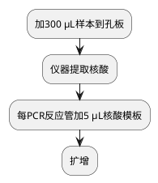

# 呼吸道病原体核酸六项检测

## 处理流程
### 仪器
%natch96%

%SCP_1000uL%

%MCP_100uL%

### 试剂
%sansure_nuc_kit%

%RPP6_kit%

### 软件

### 流程图

### 详细流程

> 可先振荡后再编号，以免编号字迹在振荡后不清晰。
> {style="note"}

<procedure>
<step>样本振荡30 s以上。</step>
<step>加300 μL样本到吸附裂解液。</step>
<step>使用%natch96%提取核酸。</step>
<step>每%PCR_tube%用%MCP_100uL%加5 μL核酸模板，最后加%NC%和%PC%。</step>
<step><include from="library.md" element-id="混匀离心"></include></step>
<step>扩增结果文件保存到 <path>%resultsPath%/%RPP6%</path> ，以 <code>%fileNaming%</code> 格式命名。编辑好样本编号等信息，开始扩增</step>
<step>扩增（约1 h）。</step>
</procedure>

| 缩写      | 项目名称      | 参考范围  |
|---------|-----------|-------|
| RSV RNA | 呼吸道合胞病毒核酸 | 阴性（-） |
| HA RNA  | 甲型流感病毒核酸  | 阴性（-） |
| HB RNA  | 乙型流感病毒核酸  | 阴性（-） |
| rhi RNA | 人鼻病毒核酸    | 阴性（-） |
| adv DNA | 腺病毒核酸     | 阴性（-） |
| MP DNA  | 肺炎支原体核酸   | 阴性（-） |

## 临床意义
流感病毒通常引起呼吸道局部感染，不引起病毒血症；
多呈季节性广泛流行，北方以冬季为主，南方四季都有发生，在夏季和冬季达到高峰1。

腺病毒主要感染儿童，大多无症状，成人高热少见。
疾病一般具有自限性，感染后机体可获得长期持续的特异性免疫能力。[^a]

呼吸道合胞病毒（respiratory syncytial virus，RSV）是引起CAP的首位病毒病原[^b]。

[^a]: ref
[^b]: 4r

> 《全国临床检验操作规程（第4版）》尚红 王毓三 申子瑜主编

> 《国家卫生和计划生育委员会住院医师规范化培训规划教材：儿科学》申昆玲 黄国英

> 医学微生物学 李凡，徐志凯

You can reference [the JetBrains website][jb] multiple times
and even use [different link text][jb] every time.

## 新型冠状病毒

扩增（约1 h）。

新型冠状病毒快检
<procedure>
<step>反应液I、反应液II和增强液混匀后，每反应管分装35 μL。</step>
<step>每管加15 μL样本，吹吸混匀。</step>
<step>瞬时离心。</step>
<step>扩增</step>
</procedure>

| 缩写          | 项目名称     | 参考范围  |
|-------------|----------|-------|
| SARS-CoV-2  | 新型冠状病毒核酸 | 阴性（-） |
| ORF1ab gene | ORF1ab基因 | >40   |
| N gene      | N基因      | >40   |

## 真菌三项

扩增（约1 h 20 min）。

| 缩写  | 项目名称    | 参考范围  |
|-----|---------|-------|
| DNA | 曲霉菌属核酸  | 阴性（-） |
| DNA | 新生隐球菌核酸 | 阴性（-） |
| DNA | 耶氏孢子菌核酸 | 阴性（-） |

## 百日咳
扩增（约1 h 20 min）。

用于流感病毒核酸检测的标本主要为鼻咽分泌物、口腔含漱液、呼吸道分泌物、气管吸出物等，以深部咳痰和气管吸出物为最佳。因为气管深部咳痰或气管吸出物检测阳性率高于上呼吸道标本，且后者还易受到其他细菌病毒的干扰。