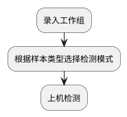
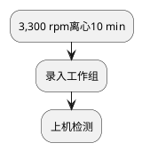
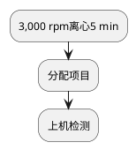
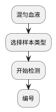
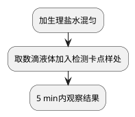
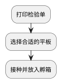

# 夜班

急诊和门诊样本尽快完成检测。

报这几个危急值的时候看着危急值的表来报

## 样本接收
集中接收时若提示无采集信息，应退回样本到送样科室并联系其处理。
收到血培养瓶后返还相应类型和数量的新培养瓶。

> %KJ%儿科不返还血培养瓶。
> {style="note"}

## 血液检验
### 血细胞分析

检测时间段：18:00～11:40；12:00～07:40（门急诊除外）

更换试剂？
1. 稀释液
2. 染色剂在BC-6000 Plus仪器内。

更换试剂后均需扫描条码。

> 核对仪器所示下个测试流水号与LIS中下个测试流水号是否一致。
> {style="warning"}

> 若为血常规和CRP等组合项目样本，可排在一起，以便在血常规检测完成后继续下一检测。
> {style="note"}

血涂片分类计数
不区分杆状核和分叶核粒细胞。

血红蛋白数值约为红细胞数值的30倍。

异常结果？
观察样本性状，比对历史结果

样本凝血？
清空LIS检测结果，在WBC、RBC、HGB和PLT处填“血凝”
在“样本评价”处添加备注信息，电话联系重新采血。

一个红细胞里面有2个及以上的环状体，环状体小，靠边，是恶性疟原虫的特点。
恶性疟原虫一般只能看到环状体和配子体，有些只能看到比较多的环状体。

> 换算单位。
> {style="warning"}

### 血沉
根据仪器提示操作即可
> 仪器提示需清洗时请勿上样。条码向外，卡紧采血管以防掉落。
> {style="warning"}

> 
> {style="warning"}

### hsCRP和SAA

### 凝血

试剂盘向下按再向上提即可打开。
若FDP>D-D，结果一般没有问题。

凝血四项和DIC的项目快捷选择代码分别为4和7。

试剂配置

|       | 溶质  | 溶剂          |
|-------|-----|-------------|
| PT    | PT干粉 | 10 mL灭菌注射用水 |
| TT    | TT干 | 专用稀释液       |
| D-二聚体 |     | 专用稀释液       |

根据xx浓度决定稀释倍数。
> 注意核对仪器下个测试流水号与LIS是否一致。
> {style="warning"}

> 若因夜间日期切换问题，仪器检测数据无法传到LIS系统，
> 可将前一天待传数据样本的样本转移至今天，仪器即可自动传输数据，
> 再更改流水号，保持连贯。
> {style="warning"}

## 生化
### 生化常规
检测时间段：18:00～11:30；12:00～07:00
> 由于LIS时间与仪器时间不在同一天时检测结果数据可能无法传输，故接近23:30时不再上样本。
> 若按仪器上开始检测键后仪器无响应，可在软件内点击开始检测。
> 脑卒中和急诊等样本要尽快出报告，并电话通知临床。
> {style="note"}

不做的项目：CRP。

软件提示装载清洗液（detergent A，DA）时，将清洗液装载到114号试剂位。

重新测定项目
<procedure>
<step>点击<control>查找F1</control></step>
<step>选中要重测的项目</step>
<step>点击<control>重测F5</control></step>
</procedure>

### 血气
仪器
沃芬GEM Premier 5000

PCT和BNP

心肌标志物

仪器
罗氏cobas 8000

> 关注样本状态是否出现未分配检测项目等异常情况。
> {style="warning"}

## 体液
### 尿液检验

400 g离心5 min
### 粪便检验
每张玻片可观察2个样本。
### 粪便隐血试验

### 脑脊液检验
BC-6000 Plus计数
镜检
### 浆膜腔积液检验
BC-6000 Plus计数
镜检
### 胸腹水检验
BC-6000 Plus计数
镜检
## 微生物
### 接种

一般样本
<procedure>
<step>进入%micro_ZS%，勾选“打印记录单”，扫描检验号，系统会自动打印记录单。</step>
<step>根据样本选择合适的平板并接种，放入培养箱。</step>
</procedure>

血培养瓶
<procedure>
<step>打印记录单方法同一般样本。</step>
<step>将培养瓶瓶身条码粘贴到检验单，瓶身备注流水号最后7位数字。</step>
<step>打开血培养仪，找到常亮绿灯的空位，将孔位编号标记到记录单和瓶身。</step>
<step>扫描检验号和瓶身条码，将培养瓶放入选定空位。</step>
</procedure>

### 报阳瓶处理

1. 加龙胆紫液染色10秒，水洗，甩干；
2. 加碘溶液染色10秒，水洗，甩干；
3. 加脱色液脱色10~20秒，水洗，甩干；
4. 最后加沙黄溶液复染10秒，水洗；
5. 待干，镜检。

注意仪器上的编号，工作组名称多以仪器编号命名。
危急值处理时限：15 min

不做的项目：
