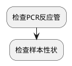

# 异常结果原因排查流程

假阳性的出现通常是由于仪器污染、扩增试剂污染、标本间的交叉污染以及扩增样品污染等情况造成的。
常见的污染源，包括实验操作中形成的气溶胶、以前的扩增产物泄漏，以及实验过程中接触的其他污染物。
避免假阳性结果应重视实验室消毒，隔离工作区，可以使用防污染（含UNG酶）的PCR试剂，以及避免试剂飞喷、
分装使用试剂、操作程序合理化、阳性对照次序靠后等来防止样品的污染。
此外，设立阴性对照是策略之一，以提示反应中是否有假阳性出现。

造成假阴性的原因有：反应中Taq酶或反转录酶失活、核酸提取试剂的效率低或提取过程中核酸发生丢失、
核酸提取中有机溶剂或扩增抑制物残留，包括Taq酶抑制剂、蛋白质和重金属离子等物质。
避免和纠正假阴性可采取重新纯化核酸、标本双份同时测定、取原始标本重新检测、设置内标等措施。
此外，实验中应设置阳性对照，以提示是否出现假阴性结果。

检查样本性状，判断是否合格。

混匀
瞬时离心
避免触碰盖子和管口造成的污染。
检查样本，及时拒收不合格样本或联系临床重新采样。

血红素及其代谢产物已知为DNA聚合酶的抑制物，不同来源的聚合酶受血红素影响的浓度也不同。

由于在加样过程中液体会有一定损失，固反应体系可以多配一些。
配试剂前换洁净手套或消毒手套。

先录入系统还是先编号？
LIS系统存在很多未知问题，如果先编号再录入系统，若系统出现故障，可能需重新编号，先录入系统再编号的可避免上述问题。

分液槽+排枪能极大提高效率。

包装里的%eightStripTubes%顺序不都是1到8，壳准备多个PCR管架，顺序和倒序的分开放，最后再调整管架方向即可。

PCR异常扩增曲线分析攻略
[https://mp.weixin.qq.com/s/dhCXDDG8S7o9JYMsWY_tiw
](https://mp.weixin.qq.com/s/pQRF5DvE5xAGuRKS6qLMfg)

[https://mp.weixin.qq.com/s/pQRF5DvE5xAGuRKS6qLMfg
](https://mp.weixin.qq.com/s/pQRF5DvE5xAGuRKS6qLMfg)

[https://mp.weixin.qq.com/s/ppSenDh5kxrcPXmialHDJA
](https://mp.weixin.qq.com/s/pQRF5DvE5xAGuRKS6qLMfg)

为什么采用荧光定量PCR检测时不宜将质控品位置固定？
答：室内质控是检验人员对实验室工作和测定结果进行的连续评价，以决定工作和结果的可靠性，其目的是保证每日或每批间测定结果的精密度。由于PCR扩增仪的反应板是由多孔组成，根据温度控制原理不同又可分为气体加热控温、压缩机控温和半导体加热控温型，对于半导体和压缩机加热控温（金属板式）的PCR仪，由于边缘效应和各孔温度的不均一性等因素，各加热区域以及各加热孔之间温度可能会存在一定的差异，如果每次扩增时质控品的放置位置固定在某一孔，便不能够全面反映由于样本位置不同对扩增效率带来的影响。因此，质控品在反应板中的位置不宜固定。