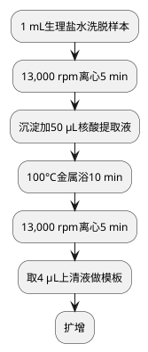

# 性传播疾病病原体三项核酸检测
### 检验流程
#### 样本核收和准备

#### 准备工作
仪器
Bio-Rad CFX96

#### 试剂配制
弱阳性对照：200 μL阳性TB/CT对照 rpm离心x min后，留50 μL底部液体，核酸提取方法同样本。
xx阳性对照取20 μL，用980 μL ddH2O稀释成弱阳性对照。

质控品：高值和临界值质控品
高值和临界值质控品核酸提取，13,000 rpm离心5 min后，其余步骤同样本。
解脲支原体：20 μL样本加980 μL ddH2O。

<procedure>
<step>加1 mL生理盐水到微量离心管，洗脱样本。</step>
<step>13,000 rpm离心5 min，弃上清，加50 μL核酸提取液至样品沉淀物中，振荡混匀。</step>
<step>100°C金属浴10分钟。</step>
<step>13,000 rpm离心10 min，上清液即含提取的核酸。</step>
<step></step>
<step></step>
<step></step>
<step></step>
</procedure>

扩增试剂准备（PCR前准备区）
从试剂盒中取出NG PCR反应液、HS-Taq plus酶、UNG，室温融化并振荡混匀后，低速离心数秒。设所需要的PCR反应管管数为n（n = 样品数 + 1管阴性对照 + 1管阴性质控+1管临界阳性质控），计算好各试剂的使用量，加入一适当体积试管中，充分混合均匀，向设定n个PCR反应管中分别加入36ul，转移至样品处理区。
加样（样品处理区） 
若样品及对照品裂解产物保存在-20℃，使用前置室温解冻，15,000 g离心5分钟。 
向所设定的n个PCR反应管中分别加入步骤1中处理过的样品、阴性对照、阴性质控品和临界阳性质控品上清液各4 μl，盖紧管盖，将PCR 反应管转移至检测区，置于PCR仪上，记录样品摆放顺序。

7.4.1  循环条件设置 :37℃：2 分钟；94℃：2分钟； 93℃：15 秒，60℃：60 秒；40个循环； 反应体系为40 μl，荧光信号收集设在60℃。
7.4.2  仪器检测通道选择
ABI 7000/7300/7500：选择FAM（Reporter： FAM； Quencher： none）检测通道，参比荧光（Passive Reference）设置为None； 具体设置方法请参照各仪器使用说明书。

## 沙眼衣原体核酸检测
核酸提取
同解脲支原体核酸提取方法
## 淋病奈瑟菌核酸检测
核酸提取
同解脲支原体核酸提取方法