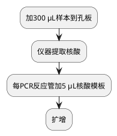

# 新型冠状病毒核酸检测

## 处理流程
### 仪器
%natch96%

%SCP_1000uL%

%MCP_100uL%

### 试剂
%sansure_nuc_kit%

%RPP6_kit%

### 软件

### 流程图

### 详细流程

| 步骤         | 温度（°C） | 时间     | 循环数 |
|------------|--------|--------|-----|
| 逆转录        | 55     | 15 min | 1   |
| Taq酶活化，预变性 | 95     | 2 min  | 1   |
| 变性         | 95     | 15 s   | 40  |
| 退火、延伸及荧光采集 | 58     | 35 s   | 40  |
| 仪器冷却       | 40     | 10 s   | 1   |

荧光通道选择：FAM（Reporter: FAM，Quencher: None）
ROX（Reporter: ROX，Quencher: None）
Cy5（Reporter: Cy5，Quencher: None）
内标设置为HEX或VIC（Reporter: HEX/VIC，Quencher: None）
体系：40 μl

扩增（约1 h）。

| 缩写          | 项目名称     | 参考范围  |
|-------------|----------|-------|
| SARS-CoV-2  | 新型冠状病毒核酸 | 阴性（-） |
| ORF1ab gene | ORF1ab基因 | >40   |
| N gene      | N基因      | >40   |

新型冠状病毒快检
<procedure>
<step>反应液I、反应液II和增强液混匀后，每反应管分装35 μL。</step>
<step>每管加15 μL样本，吹吸混匀。</step>
<step>瞬时离心。</step>
<step>扩增</step>
</procedure>
