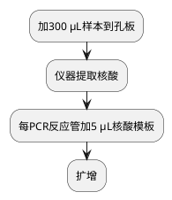

# 真菌三项核酸检测

## 处理流程
### 仪器
%natch96%

%SCP_1000uL%

%MCP_100uL%

### 试剂
%sansure_nuc_kit%

%RPP6_kit%

### 软件

### 流程图

### 详细流程

扩增（约1 h）。

| 缩写          | 项目名称     | 参考范围  |
|-------------|----------|-------|
| SARS-CoV-2  | 新型冠状病毒核酸 | 阴性（-） |
| ORF1ab gene | ORF1ab基因 | >40   |
| N gene      | N基因      | >40   |

新型冠状病毒快检
<procedure>
<step>反应液I、反应液II和增强液混匀后，每反应管分装35 μL。</step>
<step>每管加15 μL样本，吹吸混匀。</step>
<step>瞬时离心。</step>
<step>扩增</step>
</procedure>

临床真菌检测标本常来自有正常菌群存在的标本，由于正常菌群有真菌存在，这些标本核酸检测出真菌只能说明标本中含有某种真菌，不能说明该真菌的致病性和活力，也无法鉴别该真菌是致病菌还是定植菌。
故真菌核酸检测不能取代真菌培养。