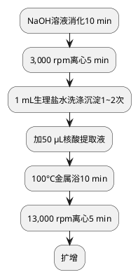

# 结核分枝杆菌复合群核酸检测
## 检测目的和原理

## 标本采集
### 样品保存
### 样品运输

## 处理流程
### 仪器、试剂和软件
#### 仪器
#### 试剂

质控品：阳性和阴性质控品

弱阳性对照配置方法，200 μL质控品离心10 min，留底部50 μL，同样本提取核酸。

核酸取液中加20 μL内标。

1. 从试剂盒中取出TB PCR反应液、Taq酶，室温融化并振荡混匀后，2,000 rpm离心10秒。将两者混充分混合均匀， 2,000 rpm离心10秒，向设定的n个PCR反应管中分别加入相应体积的反应液（43 μl/管），转移至样品处理区。
2. 加样（样品处理区） 
3. 若样品及对照品裂解产物保存在-20℃，使用前置室温解冻，13000 rpm离心5分钟离心5分钟。 
4. 向所设定的n个PCR反应管中分别加入步骤1中处理过的样品、阴性对照、阴性质控品和临界阳性质控品上清液各2 μl，盖紧管盖，将PCR 反应管转移至检测区，置于PCR仪上，记录样品摆放顺序。

#### 核酸提取

<tabs>
<tab title="痰液">

1. <include from="library.md" element-id="NaOH溶液消化"></include>
2. 取1 mL样本于离心管中，13,000 rpm离心5 min。
3. 弃上清，加1 mL生理盐水，重悬沉淀，13,000 rpm离心5 min。重复洗涤1～2次。
4. 弃上清，加50 μL核酸提取液，振荡混匀，100°C金属浴10 min，13,000 rpm离心5 min，上清液备用。
</tab>
<tab title="肺泡灌洗液">
清亮样本处理方法同尿液，有凝块同痰液。
</tab>
<tab title="胸腹水">

1. 13,000 rpm离心5 min，取沉淀。有凝块则取凝块，加适量蛋白酶，50°C消化30 min后离心。
2. 去上清，加50 μL核酸提取液，振荡混匀，100°C金属浴10 min，13,000 rpm离心5 min，上清液备用。
</tab>
<tab title="创面分泌物">

1. 加dH2O振荡。
2. 后续步骤同血性胸腹水标本。
</tab>
<tab title="尿液">

1. 混匀，取1.0 mL于离心管中，13,000 rpm离心5 min。
2. 弃上清，用1 mL生理盐水洗涤沉淀，13,000 rpm离心5 min。
3. 弃上清，加50 μL核酸提取液，振荡混匀，100°C干浴10 min，13,000 rpm离心5 min。
</tab>
</tabs>

> 对血性胸腹水等样本，若无凝块，则2,000 rpm离心2 min，取上清液13,000 rpm离心5 min，弃上清，沉淀加核酸提取液。
> 有凝块样本用蛋白酶消化后13,000 rpm离心 5min，沉淀用生理盐水洗涤一次，再高速离心。
> {style="note"}

> 如果样品裂解产物当天不使用，请于-20°C保存。
> {style="note"}

PCR扩增（扩增区） 
循环条件设置: 93℃：3 分钟；93℃：45秒， 55℃：1分钟 ，10个循环；93℃：30 秒，55℃：45秒，30个循环； 反应体系为45μl，荧光信号收集设在55℃,45秒。 
仪器检测通道选择 
ABI 7300/7500：选择FAM（Reporter： FAM； Quencher： none）检测通道，参比荧光（Passive Reference）设置为None； 具体设置方法请参照各仪器使用说明书。 
样品的设定
在扩增开始前条件设定时，待检样品和对照品：ABI 7000/7300/7500、设定为“Unknown”。

## 结果报告和解释
阳性结果判定：当样品CT值 <30，增长曲线为S形，则实验结果为阳性。

阴性结果判定：当样品CT值>30或无CT值，则实验结果为阴性
