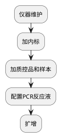

# 血源性病原体三项核酸检测
## 血液感染性疾病筛查

### 检测目的
### 检测原理
### 检验流程

#### 样本核收和准备
检查血浆量≥500 μL
#### 仪器和试剂准备

<procedure>
<step>取出核酸试剂复温，扩增试剂解冻。</step>
<step>仪器和电脑开机，抽出全部载架，装好隔片、垃圾袋。</step>
<step>运行Microlab STAR Maintenance & Verification，根据提示完成日维护或周围户。</step>
<step>全血2,200 g离心10 min。</step>
<step>运行Hamilton Run Control，输入样本数，数量为样本数加2个质控品。根据提示装载耗材，第一块深孔板右侧边需贴条码。点击 <control>OK</control> 。</step>
<step>4个内标和试剂4载入通道12，试剂1～3载入通道13。阳性和阴性质控品分别放入1号和2号位，其余样本按顺序放入。</step>
<step>待提示放入样本架时，含质控品的样本架载入通道14，其余样本架依次载入通道15～16，点击 <control>OK</control> 。</step>
<step>等待识别条码。未识别条码的样本手动编号后，点击 <control>OK</control> ，仪器开始提取核酸。</step>

> 试剂1含磁珠，需充分混匀。确保所有试剂、内标、质控品和样本装载前无气泡。
> {style="warning"}

<step>若样本总数（含质控品）≤，按每样本需反应液1:反应液2:反应液3=41:5:4的比例（μL）配制2管反应液，若>，则配制4管。</step>
<step>待仪器提示放入反应液时，放好反应液和PCR反应板，推入载架，点击 <control>OK</control> 。</step>

> 建议在核酸提取完成前30 min配制。
> {style="note"}

<step>封膜，设置好扩增程序，开始扩增。</step>
<step>回收试剂，弃废液。试剂槽用双蒸水冲洗，废液槽用消毒液浸泡。紫外线照射Microlab STARlet内部30 min。</step>
</procedure>

| 荧光报告基团通道 | 荧光淬灭基团通道 | 检测对象       |
|----------|----------|------------|
| FAM      | 无        | HIV1/2 RNA |
| HEX/VIV  | 无        | 内对照        |
| ROX      | 无        | HCV RNA    |
| CY5      | 无        | HBV DNA    |

| 步骤          | 温度（°C） | 时间（s） | 循环数 |
|-------------|--------|-------|-----|
| 预变性和酶激活     | 95     | 60    | 1   |
| 逆转录         | 60     | 1,800 | 1   |
| cDNA/DNA预变性 | 95     | 60    | 1   |
| 变性          | 95     | 15    | 45  |
| 退火、延伸及荧光采集  | 60     | 30    | 45  |
| 仪器冷却        | 25     | 25    | 1   |

步骤		温度（℃）	时间	循环数
1	预变性和酶激活	95	1min	1
2	逆转录	60	30min	1
3	Cdna/DNA预变性	95	1min	1
4	变性	95	15s	45
退火、延伸及荧光采集	60	30s
5	仪器冷却	25	25s	1

设置 Sample Volume 为 50。

| 缩写      | 项目名称       | 参考范围  |
|---------|------------|-------|
| HIV-RNA | 人类免疫缺陷病毒核酸 | 阴性（-） |
| HBV-DNA | 乙型肝炎病毒核酸   | 阴性（-） |
| HCV-RNA | 丙型肝炎病毒核酸   | 阴性（-） |

#### 常见问题
平台上未找到载架？

将载架推到位。

样本量不足/有凝块报错？

点击<control>repeat</control>后执行重新吸样操作。
若多次尝试吸样仍失败，点击<control>exclude</control>，仪器自动将下个样本位置提前。
待仪器提示手动加样时，给每块深孔板加240 μL样本，点击<control>OK</control>。

如果遇到HIV抗体是阳性，但血筛阴性的样品，建议先复查，如果两次结果一致，可以出报告。
按照目前常用的第三代HIV抗体检测试剂，HIV抗体的检测窗口期为14～35天，平均22天。而qPCR等核酸检测技术由于灵敏度高，在HIV感染后2周左右即可检出HIV病毒核酸并可对HIV核酸载量进行定量。此外，HIV还具有高度变异性，因此有可能出现HIV抗体阴性而HIV核酸阳性。